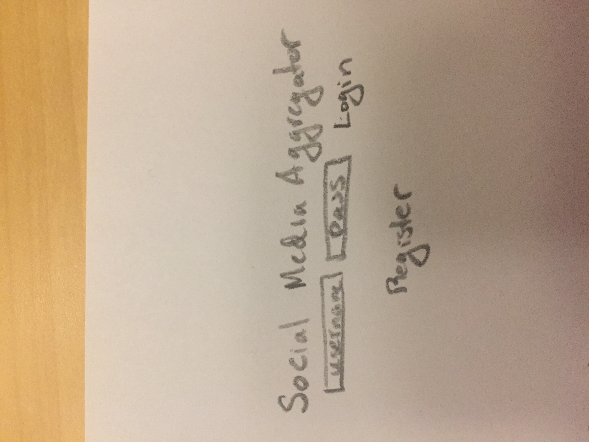
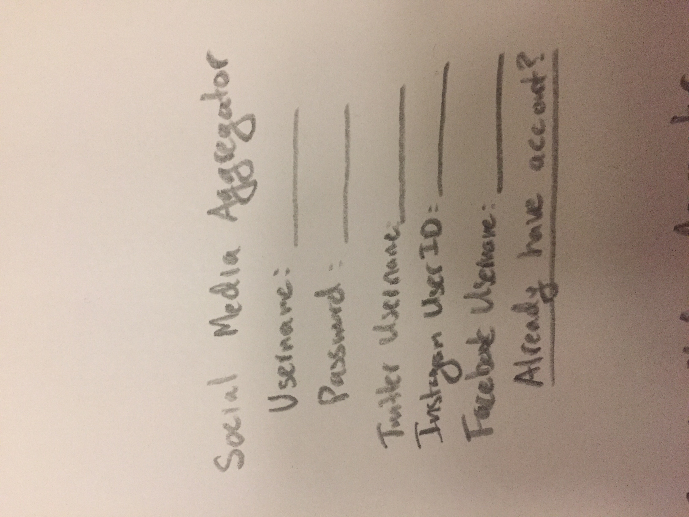
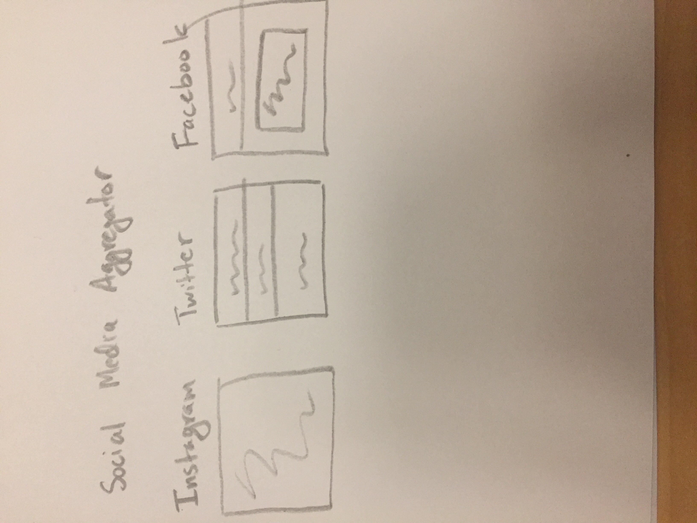
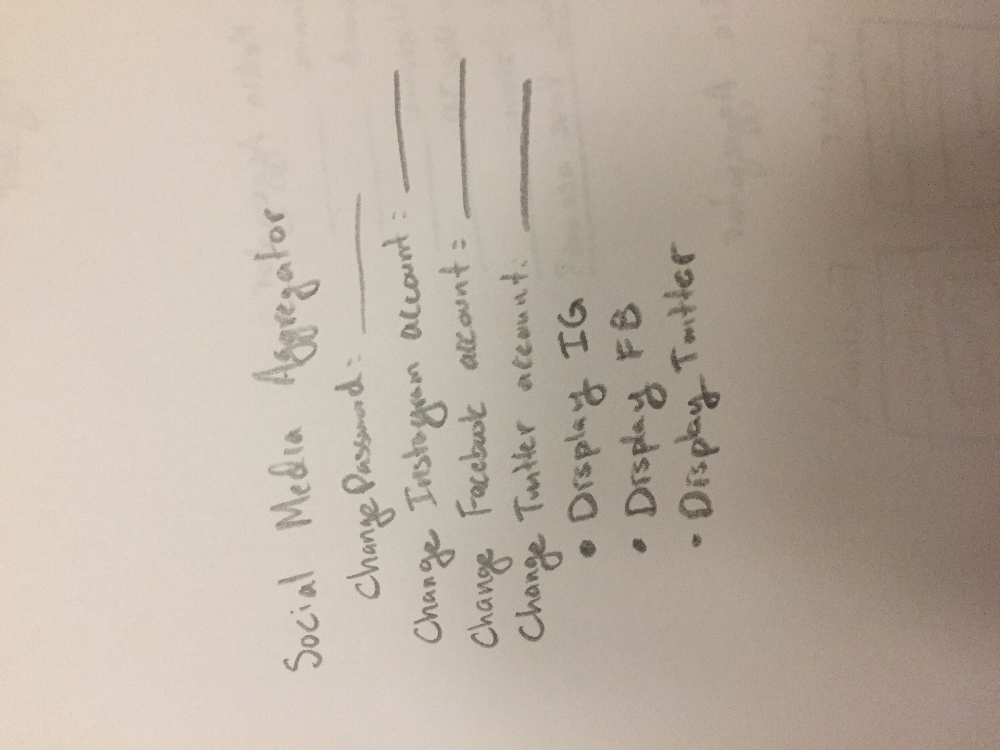

# Social Media Aggregator 

## Overview

With the amount of social media platforms that are available to users today, it's not uncommon for people to have multiple social media accounts for each platform. It 
can be hard to keep up with all your friends' social media presences without having to scroll through each platform. This is where Social Media Aggregator (not final name) comes in. 

Social media aggregator will have your friends' social media accounts all in one place. Users can register by providing a username for the web application and all their handles for their social media accounts. Once registered, they can login and choose to follow other people who are registered to Social Media Aggregator and can see all their associated recent posts for their social media handles. This web app will focus on Twitter, Instagram, and Facebook.


## Data Model

The application will store Users

* each user will have their Twitter, Instagram, and Facebook usernames stored

An Example User:

```javascript
{
  username: "greg",
  hash: // a password hash,
  twitterUsername: gregstwitter
  instagramID: 2342998
  fbUsername: gregha@facebook.com
}
```


## [Link to Commented First Draft Schema](src/db.js) 


## Wireframes

(___TODO__: wireframes for all of the pages on your site; they can be as simple as photos of drawings or you can use a tool like Balsamiq, Omnigraffle, etc._)

/ - homepage for logging in or registering



/register - register to web app with social media accounts



/user - a registered user's social media posts



/settings - change user's social media accounts and what to display



## Site map

* www.socialmediaaggregator.com -- homepage and login
	* www.socialmediaaggregator.com/register -- register for the web app
	* www.socialmediaaggregator.com/user -- user's page with social media posts
		* www.socialmediaaggregator.com/user/search -- search for a registered user on the web, redirects to /user if user is found
			* www.socialmediaaggregator.com/user -- user being the searched user if it is found
		* www.socialmediaaggregator.com/user/settings -- modify what social media accounts are shown to your followers

## User Stories or Use Cases

1. as non-registered user, I can register a new account with the site
2. as a user, I can log in to the site
3. as a user, I can see my social media feeds
4. as a user, I can search for registered users and see their social media feeds
5. as a user, I can choose what social media accounts I display

## Research Topics

* (5 points) Integrate user authentication
    * I'm going to be using passport for user authentication
* (At least 1 point) Instagram API
* (2 points) Bootstrap

Possibly 8 out of 8 points needed for research topics

## [Link to Initial Main Project File](src/app.js) 

## Annotations / References Used

1. [passport.js authentication docs](http://passportjs.org/docs) 
2. [Instagram API](https://www.instagram.com/developer/endpoints/users/) 
3. [Twitter API](https://dev.twitter.com/web/javascript/loading) 
4. [Facebook API](https://developers.facebook.com/docs/javascript/quickstart) 
